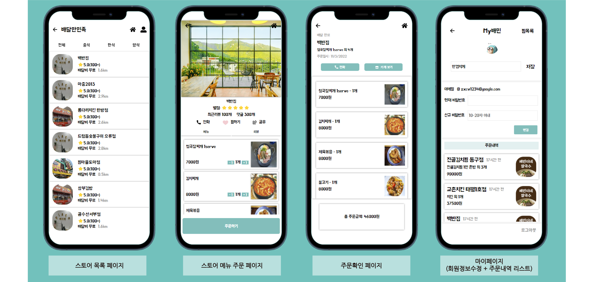

# 배달만 민족
## F반 4조
배달의 민족 클론 코딩

- 진행기간 10월28일 ~ 11월 3일
- 프론트: 김혁진, 홍정표
- 백: 김세욱, 김지헌, 문종현, 송민형
- 기술스택

  

  

   

[프론트 깃허브](https://github.com/F4-Clone-Coding/Frontend)

## 주요 기능

- 로그인/회원가입/로그아웃
- 비밀번호, 닉네임, 수정
- 매장 리스트 무한스크롤
- 매장 카테고리 분류
- 등록일, 매장의 인기, 사용자와의 거리를 바탕으로 매장 정렬
- 좋아하는 매장 찜
- 메뉴 주문 개수 조절
- 주문 확인 페이지
- 유저의 주문내역 리스트

## 완성 모습

## 트러블 슈팅
### 무한로그인
- 로그인 이후 메인페이지에 진입할 때 무한 로그인 요청이 발생
- 새로고침하면 일시적으로 문제가 해결되어 방치(?)하였으나
- 로그인 쿠키 세팅 이후 네비게이션을 setTimeout 안에 넣어서 지연처리하면서 해결됨
- 브라우저와의 상호작용도 비동기 혹은 이와 유사한 방식의 처리가 이루어지는 것으로 추정

### 쿠키 저장
- 서버에서 Set-Cookie 헤더를 사용하여 쿠키를 전송할 때 브라우저에 쿠키가 저장되지 않음
- 쿠키 옵션(httpOnly, sameSite, secure)과 credential 설정 등 관련 설정을 하여도 저장이 안됨
- [MDN Set-Cookie](https://developer.mozilla.org/en-US/docs/Web/HTTP/Headers/Set-Cookie)에 따르면 현재 환경에서는 Set-Cookie 헤더를 사용할 수 없다고함
- 우선 응답 바디에 토큰을 전달하여 프론트에서 쿠키에 저장하고 추후 다시 여유가 있으면 해결하기로 하였으나,
- 마땅한 해결방법을 찾지 못하였고 또 서버사이드 쿠키 저장이 안되어 refresh token 구현에도 지장이 생김

### ec2 데이터 저장
- 다량의 매장 및 메뉴 데이터를 데이터베이스에 저장하는 과정에서 로컬>ec2로 데이터를 전송할 때 통신 에러가 발생
- express의 request 객체가 한번에 받아들일 수 있는 데이터 용량에 한계가 있었고,
- 또, 적정 사이즈의 데이터를 보내도 다시 express<>db 처리 과정에서 작업이 지나치게 몰리면 에러가 발생
- 따라서 데이터를 적정 개수로 끊고, 또 큰 작업 사이에 지연시간을 두어 처리

